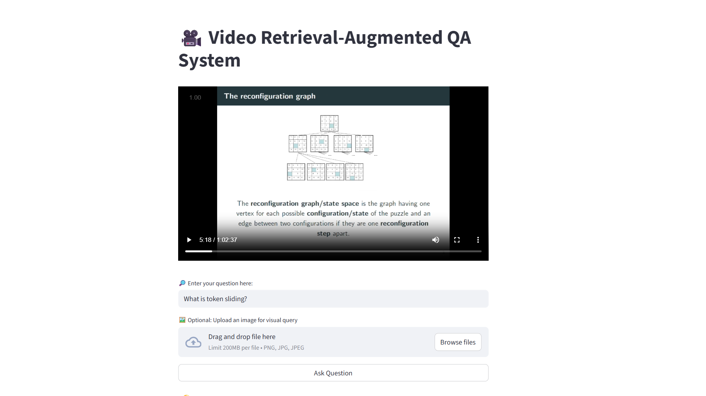

# Video RAG (Retrieval-Augmented Generation) Project

A multimodal video retrieval system that enables semantic search across video content using both text and visual queries. This project implements multiple retrieval methods (FAISS, TF-IDF, BM25) to find relevant video segments based on natural language questions or uploaded images.

## 📸 Demo

### Application Interface



The Streamlit interface provides an intuitive way to query videos using natural language or visual queries. Users can enter text questions or upload images to find relevant video segments.

### Demo Video

Watch the demo video to see the system in action:

**📹 [Click here to view and play the demo video](https://raw.githubusercontent.com/JawadKotaichh/Video-Rag-Project/main/data/demo.mp4)**

**Video Description:** This demo video showcases the complete workflow of the Video RAG system. You'll see how to query videos using natural language questions and visual queries, compare results from different retrieval methods (FAISS, TF-IDF, and BM25), and navigate directly to relevant video segments using timestamps. The demonstration includes examples of text-based queries asking questions about video content, image-based queries for finding visually similar frames, and side-by-side comparison of retrieval method results.

---

## 🎯 Overview

This project extracts keyframes and transcripts from videos, creates embeddings for both visual and textual content, and builds multiple retrieval indices to enable fast and accurate video segment retrieval. The system provides an interactive Streamlit interface for querying videos with natural language questions or visual queries.

## ✨ Features

- **Multimodal Retrieval**: Support for both text-based and image-based queries
- **Multiple Retrieval Methods**:
  - **FAISS (Text)**: Semantic search using sentence transformers
  - **FAISS (Image)**: Visual similarity search using CLIP embeddings
  - **TF-IDF**: Traditional lexical search
  - **BM25**: Probabilistic ranking function for text retrieval
- **Video Processing**: Automatic keyframe extraction and transcript generation
- **Interactive UI**: Streamlit-based web interface for easy querying
- **Evaluation Framework**: Built-in test suite for accuracy and latency benchmarking

## 📊 Performance Results

### Accuracy Comparison


| Method | Accuracy (%) | Latency (ms) |
|--------|-------------|--------------|
| FAISS-Text | 46.7 | 11.8 |
| TF-IDF | 20.0 | 0.7 |
| BM25 | 13.3 | 0.8 |

### Accuracy vs Latency Trade-offs


### Latency Analysis


## 🏗️ Architecture

The system follows a pipeline architecture:

1. **Extraction Phase**:
   - Keyframe extraction from video at regular intervals
   - Audio transcription using Whisper ASR

2. **Embedding Phase**:
   - Text embeddings using sentence transformers
   - Image embeddings using CLIP (multimodal model)

3. **Indexing Phase**:
   - FAISS indices for fast similarity search
   - TF-IDF vectorization for lexical search
   - BM25 index for probabilistic ranking

4. **Retrieval Phase**:
   - Query processing and embedding
   - Multi-method retrieval and ranking
   - Timestamp-based video segment return

## 📁 Project Structure

```
VideoRAG/
├── app/
│   ├── main.py                        # Streamlit application
│   ├── retrieval.py                   # Retrieval functions
│   ├── download_video.py              # Video download utility
│   ├── Extract/
│   │   ├── extract_keyframes.py       # Keyframe extraction
│   │   └── extract_transcript.py      # Audio transcription
│   ├── Embedding Images and Texts/
│   │   ├── embed_images.py            # Image embedding generation
│   │   └── embed_text.py              # Text embedding generation
│   └── Building Retreival Techniques/
│       ├── build_faiss_text.py        # FAISS text index builder
│       ├── build_faiss_image.py       # FAISS image index builder
│       ├── build_tfidf.py             # TF-IDF index builder
│       └── build_bm25.py              # BM25 index builder
├── data/
│   ├── video.mp4                      # Input video file
│   ├── demo.mp4                       # Demo video
│   ├── main_page.png                  # Application screenshot
│   ├── keyframes/                     # Extracted keyframes
│   ├── transcripts/                   # Generated transcripts
│   └── test_set.json                  # Evaluation test set
├── embeddings/                        # Precomputed embeddings
├── indexes/                           # Built retrieval indices
├── evaluation/
│   └── Golden_Test.py                 # Evaluation script
├── Paths.py                           # Path configuration
├── requirements.txt                   # Python dependencies
├── generate Comparison table.py       # Results visualization
├── rag.pdf                            # Project documentation
└── README.md                          # This file
```

## 🚀 Installation

### Prerequisites

- Python 3.8+
- FFmpeg (for video processing)
- CUDA (optional, for GPU acceleration)

### Setup

1. **Navigate to the project directory**:
   ```bash
   cd VideoRAG
   ```

2. **Create a virtual environment**:
   ```bash
   python -m venv .venv
   ```

3. **Activate the virtual environment**:
   - Windows:
     ```bash
     .venv\Scripts\activate
     ```
   - Linux/Mac:
     ```bash
     source .venv/bin/activate
     ```

4. **Install dependencies**:
   ```bash
   pip install -r requirements.txt
   ```

5. **Download FFmpeg** (if not already installed):
   - The project includes FFmpeg binaries in `app/ffmpeg/`
   - Or download from [FFmpeg official website](https://ffmpeg.org/download.html)

## 📖 Usage

### 1. Prepare Your Video

Place your video file in `data/video.mp4` or update the path in `Paths.py`.

### 2. Extract Content

#### Extract Keyframes:
```bash
python app/Extract/extract_keyframes.py
```

#### Extract Transcript:
```bash
python app/Extract/extract_transcript.py
```

### 3. Generate Embeddings

#### Embed Images:
```bash
python "app/Embedding Images and Texts/embed_images.py"
```

#### Embed Text:
```bash
python "app/Embedding Images and Texts/embed_text.py"
```

### 4. Build Retrieval Indices

```bash
# Build FAISS text index
python "app/Building Retreival Techniques/build_faiss_text.py"

# Build FAISS image index
python "app/Building Retreival Techniques/build_faiss_image.py"

# Build TF-IDF index
python "app/Building Retreival Techniques/build_tfidf.py"

# Build BM25 index
python "app/Building Retreival Techniques/build_bm25.py"
```

### 5. Run the Application

```bash
streamlit run app/main.py
```

The application will open in your browser at `http://localhost:8501`.

### 6. Query the Video

- **Text Query**: Enter a natural language question about the video
- **Image Query**: Upload an image to find visually similar frames
- View results from all retrieval methods with timestamps

## 🧪 Evaluation

Run the evaluation script to test retrieval accuracy:

```bash
python evaluation/Golden_Test.py
```

The script evaluates all retrieval methods against a golden test set and reports accuracy metrics.


## 🔧 Configuration

Edit `Paths.py` to customize:
- Video file path
- Transcript paths
- Embedding output paths
- Index output paths
- Keyframe extraction interval

## 📚 Technologies Used

- **Streamlit**: Web application framework
- **FAISS**: Fast similarity search library
- **Sentence Transformers**: Text embedding models
- **CLIP**: Multimodal embedding model
- **Faster Whisper**: Fast ASR transcription
- **OpenCV**: Video processing
- **scikit-learn**: TF-IDF vectorization
- **rank-bm25**: BM25 implementation

## 📝 Notes

- The system uses `sentence-transformers/all-MiniLM-L6-v2` for text embeddings
- CLIP ViT-B/32 is used for multimodal (image) embeddings
- Keyframes are extracted at 5-second intervals by default
- Transcripts are generated using Whisper base model

## 🤝 Contributing

Contributions are welcome! Please feel free to submit a Pull Request.

## 📄 License

This project is for educational and research purposes.

## 👤 Author

Jawad Kotaich

---

For more details, see the project documentation in `rag.pdf`.

